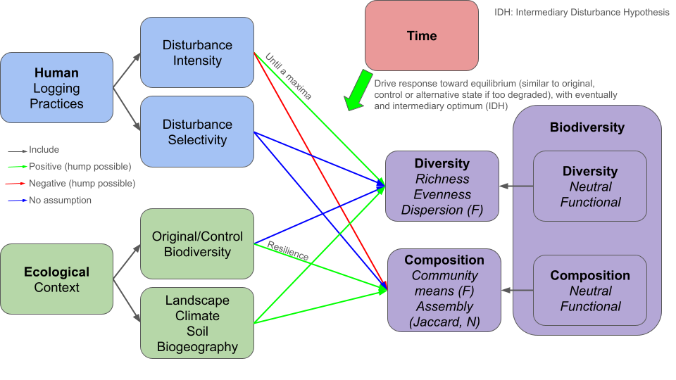

# Framework {.unnumbered}

Despite possibly using the best joint effort dataset for exploring the response of biodiversity to tropical selective logging globally, exploring the intermediate disturbance hypothesis proved challenging due to the high importance of experiment duration, census frequency (especially at intermediate timings), plot surface and taxonomic identification effort. Nevertheless, our results call into question the universality of the intermediate disturbance hypothesis across our study sites. Regarding the first hypothesis, which is that an intermediate maximum of diversity will be observed over time, genus diversity of order one showed both positive (X%, X% significant) and negative (X%, X% significant) maxima. Regarding the second hypothesis, that the intermediate maximum of diversity is driven by increasing disturbance intensity, we found both positive (X%), null (X%) and negative (X%) relations between genus diversity of order one and lost basal area. Overall, our results highlight the importance of further exploring the intermediate disturbance hypothesis, with verified cases such as Paracou in French Guiana and unexpected opposite responses, such as SUAS in Malaysia.

> Tree diversity declines initially in response to logging, but then increases through time to a maximum value, after which it then declines in late succession. Tree diversity also shows a non-linear response to increased intensity of logging (proportion of biomass or basal area damaged and/or removed)): lightly logged forests show a transient increase in tree diversity, but more intensively logged forests show a strong negative effect on diversity, which recovers through time to a maximum. Therefore a three-dimensional plot of diversity (z axis) against time and logging intensity/damage shows a peak in the centre of the 3D space. In very heavily logged forests, the recovery of tree diversity takes longer and the maximum of diversity at the mid-point succession may not be observed, indicative of a dampening of the response. Logging intensity moderates/dampens the change in tree diversity through time.

```{r ideas_fig1}
#| fig-cap: "Example scheme of ideas for the framework."

```
